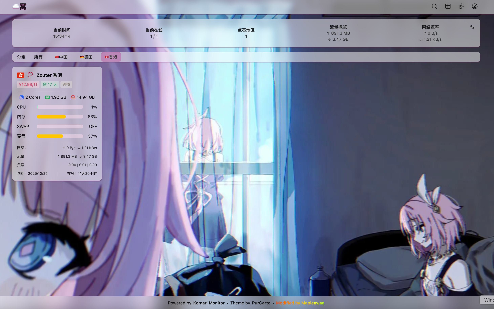

# Komari 探针主题推荐 - 选择&配置

Komari 是一个轻量化、简洁好配置的探针选择。

  作为 MJJ 最爱的轻量化探针，不自定义一下怎么好呢？

  如果你正准备部署 Komari 探针，不妨看看这些精选主题，肯定有你喜欢的。

## 安装准备

关于 Komari 的基础安装，可以参考这位佬的配置文章，写的很详细： https://idcflare.com/t/topic/18769/

------

## 🎨 主题推荐

### 1. Nezha-Dash-V1

**熟悉的哪吒风格**，是的你没有眼花。

- **项目地址：** [Github](https://github.com/Akizon77/nezha-dash-v1)
- **开发者：** [Akizon77](https://github.com/Akizon77)
- **Fork 自：** https://github.com/hamster1963/nezha-dash-v1

作者在原有接口基础上进行了适配，甚至保持了对哪吒自定义 CSS 的兼容性。

> 💡 **兼容性提示**
>  可以使用哪吒的自定义 CSS，放入自定义 Body 即可生效。虽然流量和账单功能使用 Komari 内置系统，但理论上在公开备注中使用哪吒格式也能被识别。

**适合用户：喜欢 H 佬经典的风格**

------

### 2. Light

**现代化设计美学**，要的就是数据尽收眼底的快感。

- **项目地址：** [Github](https://github.com/uvexz/komari-theme-light)
- **开发者：** [uvexz](https://github.com/uvexz)

基于 Tailwind CSS 和 shadcn/ui 设计系统的现代化主题，提供三种配色方案：

| 默认主题                                                     | 日出主题                                                     | 夜晚主题                                                     |
| :----------------------------------------------------------- | :----------------------------------------------------------- | :----------------------------------------------------------- |
|  |  |  |

#### ✨ 核心特性

- 🎨 基于 shadcn/ui 的现代化设计
- 📊 实时服务器状态监控
- 🔄 WebSocket 实时数据更新
- 📈 直观的进度条和状态指示器
- 🏷️ 服务器分组筛选功能
- 👁️ 网格和表格双视图模式
- 💾 本地存储用户偏好设置
- ⚡ 轻量化设计，最小外部依赖

**适合用户：** 追求现代化界面的用户，需要多种视图模式的专业用户

------

好的，我来修改 Mochi 部分，用表格展示各种模式的截图：

### 3. Mochi
**多模式监控体验**，一个主题，多种风格一网打尽～

- **项目地址：** [Github](https://github.com/svnmoe/komari-web-mochi)
- **开发者：** [svnmoe](https://github.com/svnmoe)

Mochi 提供了六种不同的显示模式，满足各种监控需求：

| 模式         | 描述                                           | 预览                                                         |
| ------------ | ---------------------------------------------- | ------------------------------------------------------------ |
| **Modern**   | 现代化节点管理视图                             |  |
| **Compact**  | 紧凑式快速浏览模式，旨在打造快速浏览节点的视图 |  |
| **Classic**  | 官方兼容的列表式节点管理视图                   |  |
| **Detailed** | 表格式详细信息视图                             |  |
| **Task**     | 汇总负载和 Ping 的概览模式                     |  |
| **Earth**    | 全球实时状态地图                               |  |

#### 🌟 核心特性
- 📱 优化的移动端 UI 体验
- 📊 美观易用的 PING 图表
- 🖥️ 改进的桌面端界面
- 🎨 基于原版的现代化设计
- 🧩 美化了节点详情页、PingChart 界面
- 📱 兼容桌面端与移动端
- ⚡ 优秀的性能和良好的兼容性

**适合用户：** 需要多样化显示模式的用户，重视移动端体验的用户

------

### 4. PurCarte 系列

**磨砂玻璃美学**，幻视~~Liquid Glass~~

#### ✨ PurCarte 原版

- **项目地址：** [Github](https://github.com/Montia37/komari-theme-purcarte)
- **开发者：** [Montia37](https://github.com/Montia37)

#### ✨ Next-PurCarte 

- **项目地址：** [Github](https://github.com/Mapleawaa/Another-komari-theme-purcarte)
- 开发者：[CyreneNight](https://github.com/Mapleawaa)
- **特色功能：** 在原版基础上增加自定义主题颜色和字体等更偏向个性化的功能，因直接修改原主体框架并非添加 CSS，算是独立的分支。

**适合用户：** 需要个性化定制的用户

------

### 5. ServerSentry

**次世代技术栈**，极简，快速！

- **项目地址：** [Github](https://github.com/Asahina1096/ServerSentry-Komari)
- **开发者：** [Asahina1096](https://github.com/Asahina1096)

基于 Next.js 15 + React 19 构建的现代化监控主题。

#### ✨ 技术特点

- 🚀 **现代技术栈**: Next.js 15 + React 19 + TypeScript + Tailwind CSS 4
- 📊 **全面监控**: CPU、内存、硬盘、SWAP、网络流量实时监控
- 🌐 **双栈支持**: 智能识别 IPv4/IPv6 网络状态
- 📈 **数据可视化**: 直观的图表和统计面板
- 🎨 **现代 UI**: 基于 Shadcn UI，支持深色/浅色模式
- 📱 **全端适配**: 完美支持桌面、平板、移动设备
- ⚡ **高性能**: Turbopack 开发，优化生产构建

**适合用户：** 需要极简、加载速度快的用户

------

### 6. ServerStatus-Hotaru

**经典怀旧**，类哪吒 V0

> ⚠️ **注意：** 此项目已停止更新

- **下载地址：** [Github Release](https://github.com/komari-monitor/komari-web/releases/download/1.0.3/komari-theme-hotaru.zip)
- **源代码：** [下载链接](https://raw.githubusercontent.com/komari-monitor/public/refs/heads/main/static/hotaru_theme_source.zip)

**适合用户：** 喜欢经典数据怼在脸上的表格风格

---

## 参考文献

- Komari 官方文档 - https://komari-document.pages.dev/community/theme.html

> [!note]
>
>  本文并没有用使用 LLM 创建文章内容。一些列表有点 ”AI 风味“ 来源于官方文档中的主题部分介绍。